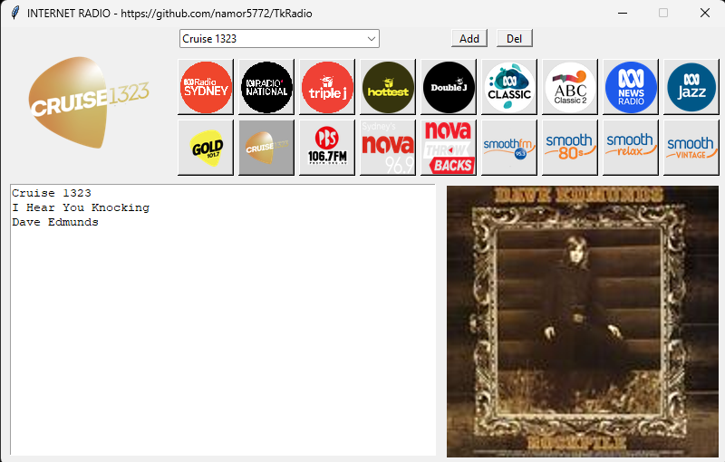
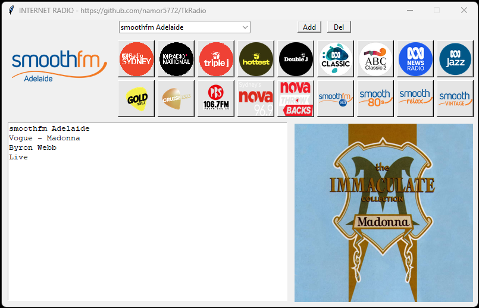

# TkRadio
An Internet Radio that uses Python with tkinter & selenium

The main python file is called RadioSelenium-RP4B.py and it implements the internet radio on Windows 11 and Linux and in particular on a Raspberry Pi 4B (although loading streams can sometimes be a bit slow). You will need to load many additional modules and the process for this will vary depending on the platform. The FireFox browser also needs to be loaded.

It has access to over 100 radio stations mainly available in Australia. It accesses the streams via the stations websites in FireFox using selenium for automation. When a station is streamed its logo is displayed. In addition the station and program text are displayed together with the program graphic (eg. the record sleeve for the album from which the current song is playing). This program information is refreshed about every 12 seconds as the stream is playing.

For convenience you can create a playlist for up to 18 stations consisting of buttons that display the station logo. There is an [Add] button which adds/replaces a station to a selected button, while the [Del] button deletes the station from the button/playlist, deleting its logo and leaving the button graphic blank. The stations to be added are selected from the combobox which enables all available stations to be streamed. You select a station from the combobox, then select a button and then press the [Add] button.

Occasionally internet/website issues might cause a station to fail to stream or or not correctly refresh the program text and graphic. This can almost always be resolved by just selecting the station again.

The currently playing station from the playlist is saved to file so that if the program is restarted it will automatically start streaming that station. The current playlist is also saved to file after any changes so that it is displayed after restart.

The RadioSelenium-RP4B.py python file can be launched from any directory as long as it contains the Images subdirectory and its files from the GitHub repository. The playlist and last streaming station files are assumed to be in the same directory.

Here we will describe in detail how to implement this radio as a dedicated app on a Raspberry Pi, in particular the hardware and software setup.

Below are two images of the applications GUI:

## Hardware

We use a Raspberry Pi 4B with 4GB of memory

## Software

Here we detail ALL the software needed for this project. Starting with the blank micro SD card that will contain all the software running on the Raspberry Pi.

1. Install the OS on a 32GB SanDisk Ultra 10 micro SD card (or equivalent). I used a Windows 11 PC with the Raspberry Pi Imager app, selecting the Raspberry Pi OS (64-bit) Debian Bookworm version. In the setup use:
    - hostname: rpi
    - username: {username}
    - password: {password}
    - SSID: {SSID}
    - password: {SSID password}
    - Wireless LAN country: AU
    - locale Australia/Sydney
    - keyboard: us

   
1. sdfsdfs
1. ddddd
