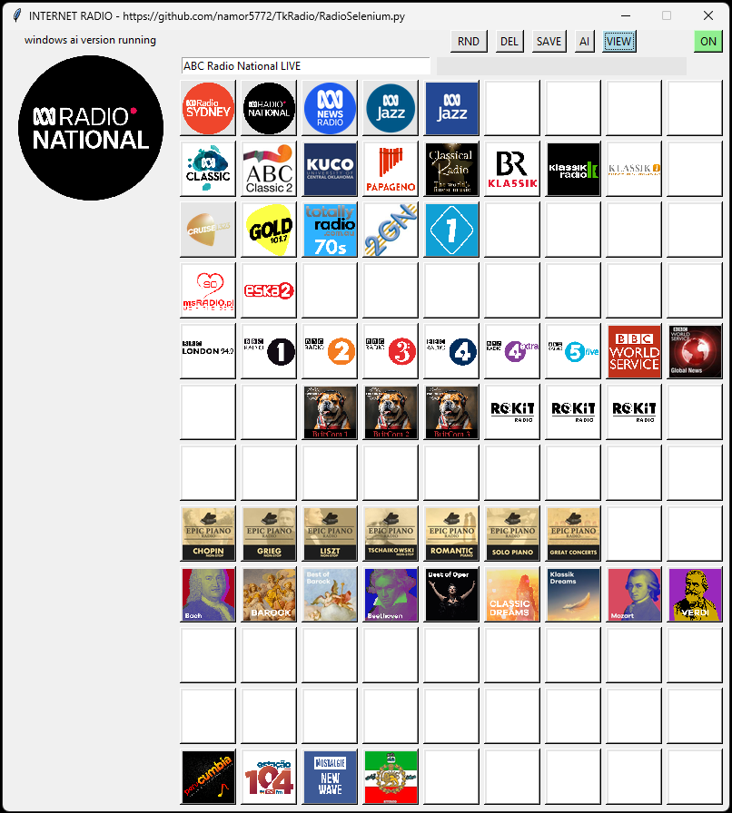
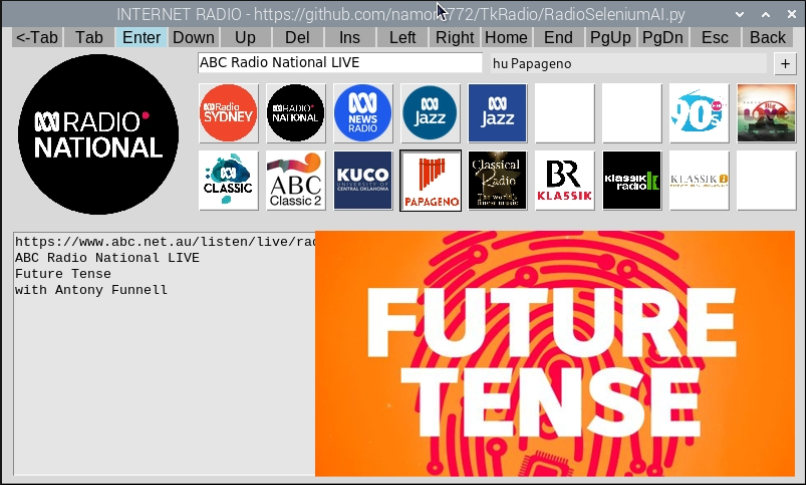
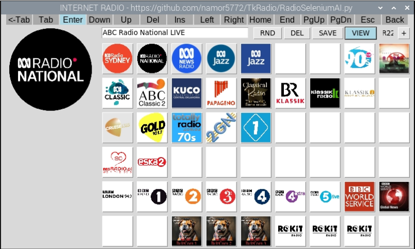
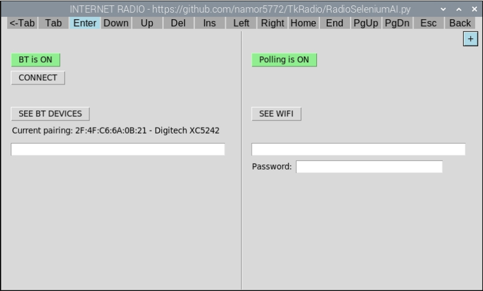

# TkRadio

### **The best way to load this software and build instructions is to Clone this Git Repository using Visual Studio Code.**

Here the building of an Internet Radio will be described in detail.
The software uses Python with tkinter and selenium, while the hardware is based on a Raspberry Pi 5.

As a standalone app (RadioSelenium.py) it can also be run under the Windows 11 OS (or other Linux versions). In those cases the installation of additional Python modules and other software setup will be significantly different and not described here (though somewhat in the [Windows setup](#windows-setup) section). The best way to do this in these cases is to try to run it and then correct errors by installing required modules or adjusting settings. Wifi/internet connections and bluetooth speakers have to be managed explicitly through the OS. RadioSelenium.py is also the file for the Raspberry Pi hardware.

The radio software has access to about 79500 radio stations with about 132 from Australia. It accesses these streams via the stations websites via the FireFox browser using selenium for automation. When a station is streamed its logo is displayed. In addition if available the stations program text is displayed together with the programs graphic (eg. the record sleeve for the album from which the current song is playing). The default is for this program information to be refreshed approximately every 12 seconds while the stream is playing.

For convenience you can create a playlist for up to 54 stations (Raspberry Pi or 108 for Windows) consisting of a matrix of buttons that display the station logos. With a playlist button selected/in focus, pressing the [Delete] key deletes the radio station assigned to that playlist button leaving the graphic blank. Similarily when the [Insert] key is pressed the station that was previously selected from the combobox is assigned to the playlist button overwiting the previous graphic.

Occasionally internet/website issues might cause a station to fail to stream or not correctly refresh the program text and graphic. This can almost always be resolved by just selecting the station again. Rarely you might need to restart the radio.

Details of the station (from the playlist) currently playing is saved to a file so that if the program is restarted it will automatically start streaming that station. The current playlist is also saved to file after any changes so that it is displayed after restart.

The RadioSelenium.py python file can be launched from any directory as long as it contains the Images subdirectory and its files from the GitHub repository. The playlist.txt, savedRadioStation.txt, bluetooth.txt, pollflag.txt, AllRadioStations.csv and StationLogs.txt files are assumed to be in the same directory as well.

When run on a Raspberry Pi the softwares gui also has a secondary form for pairing/connecting to bluetooth speakers (the default being external speakers attached to a USB port of the Raspberry Pi). In addition the connection to the wifi network can also be explicitly made through this apps form when running on a Raspberry Pi. This is necessary since when running on a Raspberry Pi, interfacing is only available through buttons with no mouse or keyboard assumed to be connected.

In the Windows case of the software we also have a text box at the bottom of the main form that can display ai generated information about the currently playing radio station. To enable this you will need to have an OpenAI account and an API Key. 

Main and only window when run on a windows PC, with ai station summary available on bottom text panel.



Main and secondary windows when run on a Raspberry Pi with PRi.GPIO module available, but no ai.




## Hardware

1. We use a Raspberry Pi 5B with 4GB of memory
1. We use an custom heatsink with  fans since the Raspberry Pi gets hot
1. We use USB powered (by the Raspberry Pi) stereo speakers that are plugged into the USB socket (if the speakers have a 3.5mm plug you must use a converter cable).
1. We use a wireless keyboard and mouse to control the software. The dongle is plugged into a USB port.
1. We use a monitor that is plugged in into the micro HDMI port of the Raspberry Pi. Use an adaptor if the HDMI cable has a standard connector.

*** COMPLETE

## Software Setup

Here we detail ALL the software needed for this project. Starting with the blank micro SD card that will contain all the software running on the Raspberry Pi.

1. Install the OS on a 32GB SanDisk Ultra 10 micro SD card (or equivalent). I used a Windows 11 PC with the **Raspberry Pi Imager v1.8.5** app, selecting the Raspberry Pi OS (64-bit) Debian GNU/Linux 12 (bookworm) OS. In the setup use:

    ```text
    hostname:             rpi
    username:             {username}
    password:             {password}
    SSID:                 {SSID}    password:             {SSID password}
    Wireless LAN country: AU
    locale:               Australia/Sydney
    keyboard:             us
    ```

1. Place the SD card into the Raspberry Pi which is assumed to have a wireless mouse & keyboard connected, a HDMI monitor connected and USB powered stereo speakers connected to the 3.5mm jack. Power up the Raspberry Pi (by plugging in a USB-C 3A rated power pack). If everthing works it should boot into the GUI. Then:
    - Confirm that the system connects to the internet or set it up via the taskbar.
    - Make the system have max volume using the slider available on the taskbar.
    - Open a terminal window and run the following commands:

        ```sh
        sudo apt update
        sudo apt full-upgrade
        sudo apt autoremove
        sudo reboot        
        ```

1. Download the GitHub repository directory TkRadio and all its contents (including subdirectories) to your /**home/{username)/** directory. You can do that via a USB stick or using Visual Studio Code to clone this repository directly to the Raspberry Pi you are using.
1. Install latest versions of Idle & Python
   - Python already installed with OS - Version 3.11.2
   - Install Idle from a terminal window with this command:

        ```sh
        sudo apt-get install idle
        ```

        When you start Idle from the taskbar, the Help => About IDLE menu selection should show you that:

        ```sh
        Python version: 3.11.2
        Tk version: 8.6.13
        IDLE version: 3.11.2
        ```

1. Install the Python Imaging Library (PIL) from the terminal with:

    ```sh
    sudo apt-get update
    sudo apt-get install python3.pil python3.pil.imagetk
    ```

1. Install the Selenium library for Python from the terminal with:

    ```sh
    sudo apt_get install python3_pip
    python3 -m venv selenium_env
    source selenium_env/bin/activate
    pip install selenium
    sudo apt-get install python3-selenium
    ```

1. Install the gekodriver (necessary for selenium to operate with the FireFox browser), Note: FireFox is already installed with the OS:

    From the <https://github.com/mozilla/gekodriver/releases> repository or otherwise (from this repository) download the tar.gz file **gekodriver-v0.36.0-linux-aarch64.tar.gz** file to the **/home/{username}/Downloads** directory and then from a terminal window run:

    ```sh
    cd /
    cd /home/{username}/Downloads
    tar -xvzf gekodriver-v0.36.0-linux-aarch64.tar.gz
    sudo mv gekodriver /usr/local/bin
    gekodriver --version
    ```

1. Open the terminal and use **alsamixer** to adjust the audio level to max. This is needed when using a Bluetooth speaker.

1. Set audio control system to PulseAudio as follows:
    run "sudo raspo-config" from a terminal
    Press Down key 5x to [6 Advanced Options] then press Enter key
    Press Down key 6x to [A7 Audio Config] then press Enter key
    You will be at [1 PulseAudio], press the Enter Key twice.
    Back at the main menu press the Tab key x2 to land on <Finish>
    Press the Enter key to return to the terminal

1. Remove the Bluetooth plugin from the taskbar as follows:
    Right mouse click an unoccupied spot on the taskbar
    A popup appears. Select the [Add / Remove Plugins...] option (with Left mouse click).
    A dialog box titled "Add / Remove Plugins" appears.
    Select the "Bluetooth" entry in either the [Left Side] or [Right Side] columns (with left mouse click)
    Left mouse click the [Remove] button
    Left mouse click the [OK] button

    This prevents popups from appearing on the main window when the app is performing bluetooth
    related actions. They take focus away from the app windows which causes problems and is annoying!

1. NOT NECESSARY: Install the Python pybluez module with:

    ```sh
    sudo apt install bluetooth libbluetooth-dev
    sudo apt autoremove
    sudo apt install python3-bluez
    ```

    In a Python script it is then accessed as: **import bluetooth**

1. NOT NECESSARY: Install the Python pynput module with:

    ``` sh
    cd /
    sudo apt install python3-pynput 
    ```

1. Setup auto-start:
    - create a directory named **autostart** in the directory **/home/{username}/.config** (which is hidden, so you need to use **ls -al** to see its contents from the /home/{username} directory)  
    - in that **autostart** directory use **sudo nano** via a terminal to create a file called **autoRadio.desktop** with the following content:

    ```sh
    [Desktop Entry]
    Type=Application
    Exec=/usr/bin/idle -r /home/{username}/TkRadio/RadioSelenium.py
    ```

    You could also just use file available in the repository, but off course you will need to replace {username} with the text relevant to your system.

1. Restart the Raspberry Pi by unplugging power and plugging it back in after a short delay, OR just type **sudo reboot** in a terminal window. If everything was correctly done then after about a minute delay the Radio App should start streaming a station (Make sure the volume is turned up on the speakers!)

1. To make this application more immmersive change the display resolution to 800x600 which matches the size of the apps form and then position the task bar at the bottom of the screen and make its icon size very large (ie. 48x48).

## Windows setup

1. installing the **selenium** Python module:

    In a terminal window type:

    ``` sh
    cd /
    pip install selenium 
    ```

He we describe how to setup the launch of this app through a desktop shortcut.

On GUI Right click mouse to open popup menu, select: New => Shortcut
A dialog box appears. Into the "Type the location of the item:" text box paste the following:

```text
C:\Users\grobl\AppData\Local\Programs\Python\Python312\pythonw.exe "C:\Users\grobl\OneDrive\GitRepos\TkRadio\RadioSelenium.py"
```

Press the [Next] button.
In the following text box titled "Type a name for this shortcut" type "RADIO" (replacing "pythonw.exe").
Press the [Finish] button.
This new shortcut then appears on the desktop with the Python icon. This can be changed if you desire. Interestingly when examining the Properties of this shortcut we have (automatically generated) the following properties:

```text
Target location: Python312
Target: C:\Users\grobl\AppData\Local\Programs\Python\Python312\pythonw.exe "C:\Users\grobl\OneDrive\GitRepos\TkRadio\RadioSelenium.py"
Start in: C:\Users\grobl\AppData\Local\Programs\Python\Python312
```

Clearly the will vary depending on which directories containing the Python script and the Python executable.

 location of firerfox.exe C:\Users\roman\.cache\selenium\firefox\win64\141.0

## Python Script


`RadioSelenium_refactored.py` is the Tkinter GUI front-end and Selenium automation layer for this project. It runs in two configurations with a single codebase:

- **Windows 11 (standalone + AI commentary):** When no GPIO is detected, the app exposes an OpenAI-powered commentary panel that can summarise or contextualise the currently selected station.
- **Raspberry Pi 5 (5″ touchscreen + rotary encoder):** When GPIO is present, the app treats a push-button rotary encoder as the primary input, enabling couch-friendly control without a keyboard or mouse.

On startup the script detects the environment, initialises resource folders (logos and program art), loads the station database, prepares a per-platform Firefox profile, and launches headless Firefox via Selenium.

---

### Architecture at a Glance

**Core ideas:**

- **Station database + driver mapping:** Stations are defined in `AllRadioStations.csv` and reference a *driver name* (e.g., `Radio3`, `Commercial2`). At load time these strings are mapped to actual Python functions via a `function_map`. This makes it easy to add or retarget stations without changing code.
- **Station-driver pattern:** Each driver encapsulates how to navigate to **Listen Live**, how to click the correct DOM element, and how to extract “now playing” metadata and imagery. There are multiple `RadioX` drivers for ABC variants and `CommercialX` drivers for commercial aggregators.
- **Shared utilities:** A small toolkit handles navigation, HTML parsing (BeautifulSoup), image download/resize/cropping (Pillow), and consistent GUI updates.
- **Resilience:** Firefox is periodically restarted to prevent Selenium/driver accretion and to recover from unexpected page states. On errors during a play request, the app restarts Firefox and *replays the last action* automatically.

```
AllRadioStations.csv  ─┐
                       ├─→  aStation[] rows with { name, url, StationFunction, DOM hints, etc. }
function_map { "Radio3": Radio3, "Commercial2": Commercial2, ... }
                       └─→  on_select(row) → dispatch to the correct driver → update GUI
```

---

### Files & Directories

- `Images/` — cached logos, program artwork, and 108 preset-button thumbnails (`button0.png` … `button107.png`).
- `AllRadioStations.csv` — master station list (includes driver names).
- `playlist.txt` — the 12×9 preset grid (each slot stores a label and an index into `aStation`).
- `savedRadioStation.txt` — remembers the last preset played so the next launch resumes on it.
- `StationLogs.txt` — appended when you press **SAVE** (may include AI commentary on Windows).
- `bluetooth.txt`, `pollflag.txt` — Raspberry Pi persistence for Bluetooth state and polling preference.
- **Firefox profiles** — a dedicated profile per platform (Windows vs RPi) for clean, repeatable sessions.

---

### GUI Layout & Controls

- **Search / Select (combobox):** Type to filter; use arrows/PageUp/PageDown; press **Enter** to play. The dropdown list is optimised for very large station sets.
- **Preset grid (“playlist”):** 108 buttons arranged in a 12×9 grid. Each shows a thumbnail image. Keyboard: **Enter** to play focused preset, **Delete** to clear that slot.
- **Text areas:**
  - **Program Info** (always visible): “Now playing” text scraped from the station page.
  - **AI Commentary** (Windows only): Read-only panel updated when you press **AI**.
- **Top-row controls:**
  - **RND** — choose a random station.
  - **DEL** — clear program art/text and manage preset removal when focused.
  - **SAVE** — append a snapshot of current station/program info (and AI text on Windows) to `StationLogs.txt`.
  - **AI** — generate a concise station summary (Windows only).
  - **VIEW** — toggle visibility/layout of the preset grid.
  - **+** — on RPi, opens the Setup window (Bluetooth/Wi-Fi helpers); on Windows, toggles metadata polling.

**Raspberry Pi input model:**  
The push-button rotary encoder emulates directional navigation and “Enter”. As you rotate, the focus moves through the interactive widgets; pressing clicks. The top label row acts as a “key bank” legend so the user always knows what press/rotate will do.

---

### Typical Usage

**Windows 11**

1. Run `RadioSelenium_refactored.py`.  
2. Use the combobox to search; **Enter** to play.  
3. Optionally press **AI** to produce an overview of the currently playing station.  
4. **RND** for a random pick, **SAVE** to log the moment, **VIEW** to toggle playlist, **DEL** to clear a preset slot.

**Raspberry Pi 5**

1. Wire the rotary encoder (e.g., CLK/DT/SW to appropriate BCM pins).  
2. Rotate to move focus; press to activate.  
3. Press **+** to open Setup (Bluetooth/Wi-Fi) and to reflect persisted states.

On both platforms the last-played preset is restored on launch and can auto-start after the GUI initialises.

---

### Playback Flow (What Happens When You Press Play)

1. **Selection:** Either a combobox choice (`on_select(..., fromCombobox=True)`) or a preset button press.  
2. **Routing:** The chosen station’s CSV row provides the `StationFunction` and DOM hints. The mapped driver:
   - Navigates to the station page and finds the correct Play control.
   - Clicks/activates the player and waits for readiness.
   - Scrapes “now playing” text and downloads/upscales/crops artwork.
   - Updates the GUI (logo, program art, metadata text).
3. **Persistence:** The current preset index is written to `savedRadioStation.txt` for next time.

---

### AI Commentary (Windows Only)

Pressing **AI** spawns a worker thread that packages the current program info and sends it to an OpenAI model (e.g., `gpt-4.1`) with a brief, purpose-built system prompt. The response is rendered into the read-only commentary panel. The threading keeps the UI responsive and avoids blocking the Selenium workflow.

---

### Polling & Scheduled Restarts

- **Polling:** Optional periodic re-scrape of the active station page to catch changes in text/artwork. The state is remembered (`pollflag.txt`).
- **RegularRestart():** A lightweight scheduler can restart Firefox at a configurable interval (default ~1 hour) to clear driver state and keep long-running sessions healthy.

---

### Extending & Maintaining

- **Add a station:** Append a row to `AllRadioStations.csv`. Choose an existing driver (`Radio1`…`Radio7`, `Commercial1`…`Commercial2`) and provide any required DOM hints. No code changes needed for common cases.
- **Add a new driver:** Implement `RadioX`-style logic using the helper utilities (navigation, soup extraction, image fetch/resize, GUI update). Register it in `function_map` so CSV rows can reference it by name.
- **Manage presets safely:** The preset grid (labels + indices) lives in `playlist.txt`. The application updates thumbnails and indices defensively if you remove stations from the master list.

---

### Dependencies & Environment

- **Python:** Tkinter, Pillow, Requests, BeautifulSoup (bs4), Selenium, psutil; on Raspberry Pi, `RPi.GPIO`.  
- **Browser stack:** Mozilla **Firefox** and **geckodriver** installed and available on `PATH`. The app uses **headless** mode with an explicit per-platform profile for stability.  
- **OpenAI (Windows only):** An API key in your environment when using AI commentary.

> **Design intent:** A clear separation between *data* (CSV), *drivers* (per-site automation), and *GUI* (Tkinter + images) makes the system maintainable, portable across Windows/RPi, and resilient during long listening sessions.

## Parts list

### Core components

Pricing and availability as of 27-Jan-2025. Total cost is $221.47, but clearly some of the items will be usable in many other projects or you will already have them. The pro rata cost is __$138.66__

You will also need a soldering iron and solder, some sellotape and a glue gun with glue sticks. Also some super glue.

| Qty | Product | Description | AUD Cost | Comment | Designator |
| --- | --- | --- | --- | --- | --- |
| 1 | [RP-SC1111](https://raspberry.piaustralia.com.au/products/raspberry-pi-5?variant=44207825617120) | [Raspberry PI 5B](ImagesDocs/RaspberryPI5.png) 4GB | $100.98 | The brains of this project | |
| 1 | [RP-SC1148](https://raspberry.piaustralia.com.au/products/raspberry-pi-active-cooler) | Raspberry Pi [Active Cooler](ImagesDocs/RPI5activeCooler.png) | $8.95 | Absolutely necessary to keep the RPI5 cool | |
| 1 | [XC9024](https://www.jaycar.com.au/p/XC9024) | [5 Inch Touchscreen](ImagesDocs/5inchTouchscreen.png) with HDMI and USB | $119.00 | based on the XPT1046 Touch Controller, see [Manual](Hardware/SR1230_manualMain_94019.pdf) | |
| 1 | [RP-SC1150](https://raspberry.piaustralia.com.au/products/raspberry-pi-27w-usb-c-power-supply?_pos=1&_psq=RP-SC1150&_ss=e&_v=1.0&variant=44207871328480) | Raspberry Pi 27W USB-C [Power Supply](ImagesDocs/PowerSupply.png) | $25.37 | Needed for power hungry Raspberry Pi5 | |
| 1 | [HD-203-0.3M](https://www.amazon.com.au/Thsucords-Micro-Flexible-Supports-18gbps/dp/B0BP29QTJ6/ref=sr_1_1?crid=XOGLPO6XRAKS&dib=eyJ2IjoiMSJ9.5fVBWJr2pX5EGbrBqtl4Rg.0vgcHY3JenNL7yyp8PRcAsHz90e8YfWwQgfYZRkr6tA&dib_tag=se&keywords=hd-203-0.3m&qid=1747122135&sprefix=%2Caps%2C238&sr=8-1&th=1) | Micro HDMI to HDMI [Cable](ImagesDocs/HDMIcable.png) 0.3M | $11.99 | Shortest cable needed for constrained space | |
| 1 | [XC3736](https://www.jaycar.com.au/p/XC3736) | Arduino Compatible Rotary [Encoder Module](ImagesDocs/EncoderModule.png) | $9.95 | Based on model KY-040, see [this](Hardware/XC3736_manualMain_94604.pdf), [this](Hardware/ky-040-datasheet.pdf) and [this](Hardware/KY-040.pdf)| U2 |
| 1 | [HK7011](https://jaycar.com.au/p/HK7011) | 29mm Black Anodised [Knob](ImagesDocs/KnobAnodised.png) | $9.95 | used on above Rotary Encoder Module | |
| 1 | [ZC4821](https://jaycar.com.au/p/ZC4821) | [74HC14](ImagesDocs/74HC14.png) Hex Schmitt trigger Inverter CMOS IC | $1.45 | Used in debouncing circuit, see [datasheet](Hardware/ZC4821_datasheetMain_40327.pdf) | U1 |
| 3 | [RM7125](https://jaycar.com.au/p/RM7125) | 100nF 100VDC MKT Polyester [Capacitor](ImagesDocs/PolyCap.png) | $1.20 | Used in debouncing circuit | C1, C2, C3 |
| 1 | [RC5324](https://jaycar.com.au/p/RC5324) | 100pF 50VDC Ceramic [Capacitors](ImagesDocs/CeramicCap.png) - Pack of 2 | $0.45 | Used in debouncing circuit | C4, $0.23 cost used |

### Other parts

| Qty | Product | Description | AUD Cost | Comment | Designator |
| --- | --- | --- | --- | --- | --- |
| 1 | [WW4030](https://jaycar.com.au/p/WW4030) | Tinned Copper [Wire](Images/CopperWire.png) 22AWG - 100 gram Roll | $19.95 | for wiring up above Vero board | $0.80 cost used|
| 1 | [HM3212](https://jaycar.com.au/p/HM3212) | 40 Pin Header Terminal [Strip](Images/TerminalStrip.png) (used most) | $1.10 | for soldering in sections to boards to attach to veroboard | |
| 1 | [WH3004](https://jaycar.com.au/p/WH3004) | Yellow Light Duty Hook-up [Wire](Images/WireYellow.png) - 25m (less than 30cm needed) | $5.95 | used for miscellaneous connections | $0.08 cost used |
| 1 | [WH3007](https://jaycar.com.au/p/WH3007) | White Light Duty Hook-up [Wire](Images/WireWhite.png) - 25m (less than 30cm needed) | $5.95 | used for miscellaneous connections | $0.08 cost used|
| 1 | [HP0924](https://jaycar.com.au/p/HP0924) | M3 x 12mm Tapped Nylon [Spacers](Images/Spacers.png) - Pk.25 (only need 4x 3mm)| $9.95 | For mounting screen to Jiffy case | $0.80 cost used |
| 1 | [HP0403](https://jaycar.com.au/p/HP0403) | M3 x 10mm Steel [Screws](Images/Screws.png) - Pk.25 (only need 4) | $2.95 | For mounting screen to Jiffy case | $0.48 cost used |
| 1 | [HP0425](https://jaycar.com.au/p/HP0425) | M3 Steel [Nuts](Images/Nuts.png) - Pk.25 (only need 4)| $2.95 | For mounting screen to Jiffy case | $0.48 cost used |
| 1 | [HP0148](https://jaycar.com.au/p/HP0148) | 3mm Nylon [Washers](Images/Washers.png) - Pk.10 (only need 0)| $2.50 | For mounting screen to Jiffy case | $0.00 cost used |
| 1 | [HM3230](https://jaycar.com.au/p/HM3230) | 40 Pin Female Header [Strip](Images/FemaleStrip.png) (only 8 used) | $2.50 | For mounting screen to Jiffy case | $0.50 cost used |

## Troubleshooting

### Maintainers’ Notes (Station Drivers)

The station drivers (`Radio1`…`Radio7` and the commercial variants) share a common flow:
1) **Navigate** to a clean page and then the target URL, 2) **Prime/Click** the correct
Listen/Play control (sometimes after keystroke-based timezone selection), 3) **Images**:
logo to `label` (scaled to `iconSize`) and program art to `label2` (square or rectangular
resize), 4) **Text**: parse “Live/Now Playing” and synopsis via BeautifulSoup and return
the **same `*`-separated string** the GUI expects.

After refactoring, the repeated steps live in small helpers (`_navigate_to_station`,
`_fetch_image_to`, `_display_logo_from_file`, `_display_program_image_square/_rect`,
`_lift_program_image_at`, `_soup_inner_html`, `_trim_after`). Geometry and global names
(`pathImages`, `Xprog`, `X1`, `Xgap*`, `Ygap*`, `HiddenFlag`, `addFlag`, etc.) are
preserved exactly to avoid visual drift on Windows and Raspberry Pi.

**Order matters**: keep *helpers → driver functions → function map*. If the dispatch
dictionary references a `RadioX` defined below it, Python will raise `NameError` at import
time.

For a short, contributor‑friendly guide (patterns, selectors, testing checklist), see:
**[README_StationDrivers.md](README_StationDrivers.md)**.


Here we describe the design and use of the python script [RadioSelenium.py](RadioSelenium.py) that implements the gui interface to this web radio.

The core purpose of this python script which uses **Firefox + Selenium** under the hood it is to stream a selected internet radio station, as well as displaying and refreshing any program details and graphics approximately every 12 seconds (while the station is streaming). The station Logo is also displayed.

### Highlights

- 79k+ stations supported via `AllRadioStations.csv` (plus presets/playlist buttons).
- Two rich image areas: **station logo** and **program/presenter** artwork.
- **Polling**: auto-refreshes program text/artwork every _N_ seconds while streaming.
- **Resilience**: scheduled Firefox restarts to avoid memory leaks; geckodriver cleanup.
- **Playlist grid** (54/RPi5 or 108/Win11 buttons): insert/delete/replace stations, with per-button icons.
- **Raspberry Pi 5 UX**: rotary encoder scroll + push = “Enter”, Bluetooth pairing, Wi-Fi connect.
- **Windows AI panel**: optional (Only Win11) OpenAI summary/history table of the current station.
- **All state is persisted** across runs (last station, playlist, logs, poll/bluetooth status).

---

### Repository & entry point

- Repo: `https://github.com/namor5772/TkRadio`
- Script: `RadioSelenium.py` (run it from the repo folder)

---

### The main window (common)

- **Combobox** (top-left): pick a station from `AllRadioStations.csv`, press **Enter** to start streaming.
- **Station logo** (left) + **Program image** (right): updates after the stream starts.
- **Text panel**: station URL, name, now-playing details, and status/errors.

### Playlist grid (56/RPi5 or 108/Win11 buttons)

- **Insert**: highlight a playlist button, choose a station in the combobox, press **Insert** → the button stores that station and gets its logo.
- **Play**: focus a button and press **Enter**.
- **Delete**: focus a button and press **Delete** to clear it.
- **Move focus**: arrow keys move across the 9x6/RPi5 or 9×12/Win11 grid (wrapping behavior implemented).

### Top row actions (Windows mode)

- **RND** — pick a random station into the combobox and start it.
- **DEL** — remove the currently selected combobox station from the master CSV and rewrite presets accordingly.
- **SAVE** — append the current text panel (and AI text if any) to `StationLogs.txt`.
- **AI** — Only for Win11 version sends the current text panel as context to the OpenAI API and renders a clean summary + a 2-column table (“Feature”/“Description”).
- **VIEW** — toggle between **playlist grid view** and **full program/text view**.
- **+ (poll toggle)** — turns periodic scraping on/off (writes to `pollflag.txt`).

### Raspberry Pi 5 mode (GPIO + 5″ screen)

- **Rotary encoder**:
  - Rotate to step through a bank of “virtual keys” (displayed along the top).
  - Press to **send** that key to the focused widget (e.g., the combobox or text area).
- **Setup panel** (press the **+** button in the title row):
  - **Bluetooth**: toggle BT on/off, scan for devices, pair/connect (stores `bluetooth.txt`), and reconnect to last device.
  - **Wi-Fi**: scan visible SSIDs, connect with saved credentials, or enter a password.
  - **Polling**: toggle program/presenter auto-refresh.

> Notes:

> - When **Polling** is ON, TkRadio re-runs `on_select()` every *refreshTime* seconds (default 10s) to fetch text/artwork.
> - To avoid “Selenium drift”, a **RegularRestart** triggers a clean Firefox restart every *resetTime* seconds (default 3600s). Streaming resumes automatically.

---

### Station catalog (`AllRadioStations.csv`)

Each row defines a station and how to start it:

```txt
[LongName, StationLogoName, StationFunction, nNum, sPath, sClass, nType]
```

- **LongName**: display name; first two chars are used as a country “code”.
- **StationLogoName**: used to find an image `Images/<StationLogoName>.png`.
- **StationFunction**: one of:
  - `Radio1`..`Radio7`: ABC network variants (different page layouts).
  - `Commercial1`: iHeart + Smooth/Nova.
  - `Commercial2`: radio-australia.org and similar aggregator pages.
- **nNum/sPath/sClass/nType**: parameters the function uses to:
  - open the correct URL (`sPath`),
  - press the right “Listen” button,
  - scrape the correct text nodes (`sClass`) and program image path,
  - apply function-specific behavior (`nNum`, `nType`).

**Example** *(conceptual)*:

```csv
"ABC Classic2","ABC_Classic2","Radio1","7","https://www.abc.net.au/listen/live/classic2","","0"
```

### How the CSV is loaded

- The app maps the function name string (e.g., `"Radio3"`) to the actual Python function via `function_map`, then builds `aStation[]`.
- On Windows startup it also creates a string list for the combobox labels.

> You can remove a station line at runtime using **DEL** (Windows): the app rewrites the CSV and shifts any preset indices that pointed past the deleted row.

---

### Core flow

- **Selenium setup**  
  The app launches Firefox in headless mode with a fixed profile folder:
  This ensures that the browser is "clean" at startup, no cookies, cache and other garbage on startup!
  - Windows: `./firefoxProfileWindows`
  - Pi: `./firefoxProfileRPI5`
- **on_select(event, fromCombobox)**  
  The central dispatcher. It:
  1. Reads the chosen station (from combobox or preset).
  2. Clears images, prints a “Please be patient” message.
  3. Runs the station’s **StationFunction** (`Radio1`..`Commercial2`) which:
     - opens a blank page to “clean” state,
     - opens the station page,
     - presses the correct *Listen* button (XPaths / `ActionChains`),
     - fetches now-playing text & artwork (BeautifulSoup over page HTML),
     - saves/loads a logo to `Images/<StationLogoName>.png`,
     - returns a `*`-separated text bundle (URL, title, program text…).
  4. Renders text and images, optionally schedules another `on_select()` (polling).
  5. Persists the last played preset (`savedRadioStation.txt`).

- **RegularRestart() & RestartFirefoxAndLastStation()**  
  Close browser, **kill geckodriver** PIDs (via `psutil`), relaunch Firefox, and resume streaming the last station.

- **Commercial2** (advanced)  
  Handles pages that open an extra window/tab for playback; detects whether streaming is working by introspecting SVG path state; can create a throwaway tab to download a remote image if needed, then closes it.

- **CustomCombobox**  
  Fully custom widget: `Up/Down`, `PgUp/PgDn`, `Enter`, `Esc`, with a borderless dropdown `Toplevel` + `Listbox`. Helps on small screens and with encoder controls.

- **GPIO path**  
  If `RPi.GPIO` imports successfully, the app:
  - Sets up interrupts for the encoder pins.
  - Converts rotations to index changes and the push to a `<Key-*>` event into the focused widget (the “virtual key row” shows which key will be sent next).

- **State files**
  - **Playlist**: `playlist.txt` keeps `108 × [name, index]` pairs (index into `aStation`).
  - **Poll**: `pollflag.txt` drives the periodic re-scrape toggle.
  - **Bluetooth**: `bluetooth.txt` stores ON/OFF and the last paired MAC/name.
  - **Logs**: `StationLogs.txt` accumulates saved text and (Windows) AI summaries.

- **Windows AI thread**
  - The **AI** button captures the text panel, calls OpenAI Chat Completions (model `gpt-4.1`) in a background thread, then renders the result into the AI panel. (Set `OPENAI_API_KEY` to enable.)

---

### Keyboard & controls

- **Combobox**: `Enter` to stream, `Up/Down` to move, `PgUp/PgDn` to jump.
- **Playlist buttons**: `Enter` to play, `Insert` to assign current combobox station, `Delete` to clear, `Arrows` to navigate the grid.
- **Text panels**: `Shift+Tab` is mapped properly across platforms.
- **Raspberry Pi**: Use the encoder to scroll/select; press to “type” the chosen virtual key into the focused widget.

---

### Troubleshooting

- **“Firefox/geckodriver not found”**: Ensure both are installed and on PATH.
- **No images / broken logos**: Make sure `Images/` exists and contains `Blank.png`. The app will save per-station logos on the fly where possible.
- **“Streaming is not working” text**: Some sites geo-block or change markup. Try again later; consider increasing `needSleep` or turning **Polling** off.
- **Bluetooth/Wi-Fi issues (Pi)**: The app shells out to `bluetoothctl`, `nmcli`, `rfkill`, and `iwlist`. Confirm these tools work from the terminal with your permissions.

---

### Extending the station list

1. Add a new row to `AllRadioStations.csv`.
2. Pick the appropriate **StationFunction** and fill its parameters:
   - For ABC variants, prefer `Radio1`..`Radio7` with the right `nNum` and XPaths already coded.
   - For iHeart / Smooth / Nova, use `Commercial1` with the right `nType`.
   - For radio-australia.org & similar, use `Commercial2`.
3. Drop a logo PNG into `Images/` named exactly as `StationLogoName + ".png"` (or let the app try to fetch one, where supported).

---

### Notes on site automation

TkRadio uses Selenium to drive public “Listen Live” pages exactly as a human would. Respect the sites’ terms of use; don’t hammer pages (Polling exists, but use sensible intervals).

---

