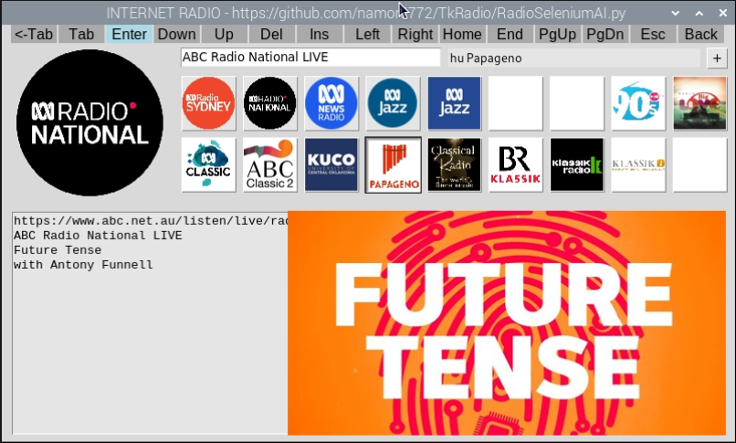
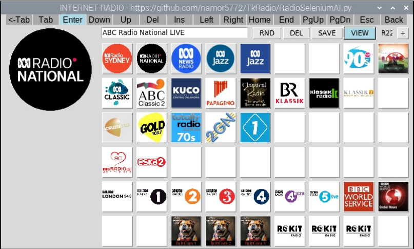
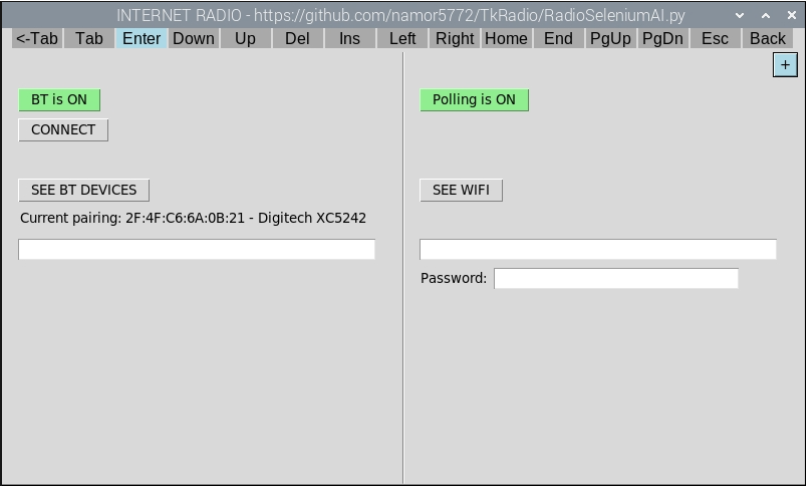

# TkRadio

A Tkinter-based Internet Radio Player using Selenium to automate Firefox for audio playback from ~79,400 radio stations worldwide (~132 from Australia).

**The best way to load this software is to clone this Git Repository using Visual Studio Code.**

Repo: <https://github.com/namor5772/TkRadio>  
Script: `RadioSelenium.py` (single-file application, run from the repo folder)

The radio accesses streams via station websites through a headless Firefox browser automated by Selenium. When a station is streaming, its logo is displayed alongside program artwork (e.g. album cover) and "Now Playing" text, refreshed approximately every 12 seconds.

The software runs in three modes from a single codebase:

- **Raspberry Pi 5** (primary target): 5-inch touchscreen, rotary encoder input, Bluetooth speakers, GPIO integration
- **Windows 11** (standalone): mouse/keyboard, AI-powered station commentary via OpenAI
- **macOS** (tertiary): mouse/keyboard, same layout as Windows, AI commentary available when `OPENAI_API_KEY` is set

Main window on Windows with AI station summary panel:


Main and secondary windows on Raspberry Pi:




---

## GUI Layout & Controls

### Search / Select (Combobox)

Type to filter the ~79,400 stations. Use `Up`/`Down` arrows, `PgUp`/`PgDn` to navigate, `Enter` to play, `Escape` to close the dropdown.

### Preset Grid (Playlist)

54 buttons (6x9) on Raspberry Pi or 108 buttons (12x9) on Windows, each showing a station logo thumbnail.

- **Enter** — play the focused preset
- **Insert** (or **Cmd-I** on macOS, since Mac keyboards lack an Insert key) — assign the current combobox station to the focused button
- **Delete** — clear the focused button
- **Arrow keys** — navigate the grid (wrapping)

### Top Row Buttons

| Button | Function |
|--------|----------|
| **RND** | Play a random station |
| **DEL** | Remove the current station from the master CSV |
| **SAVE** | Append current station/program info to `StationLogs.txt` |
| **AI** | Generate an OpenAI summary (Windows only) |
| **VIEW** | Toggle between playlist grid and full program/text view |
| **+** | RPi: open Setup panel (Bluetooth/Wi-Fi). Windows: toggle polling |

### Raspberry Pi Input (Rotary Encoder)

The push-button rotary encoder emulates keyboard navigation. Rotating steps through "virtual key banks" (displayed along the top row); pressing sends the selected key to the focused widget.

### AI Commentary (Windows Only)

Pressing **AI** sends current program info to OpenAI (model `gpt-4.1`) in a background thread and renders a summary in the bottom text panel. Requires `OPENAI_API_KEY` environment variable set.

---

## How Playback Works

1. **Selection** — combobox choice or preset button press triggers `on_select()`
2. **Routing** — the station's CSV row provides `StationFunction` and DOM hints. The mapped driver:
   - Navigates to the station page and clicks the Play/Listen button
   - Scrapes "Now Playing" text and downloads artwork via BeautifulSoup
   - Updates the GUI (logo, program art, text)
3. **Persistence** — the current preset index is saved to `savedRadioStation.txt`
4. **Polling** — optionally re-scrapes every ~12 seconds to refresh program info

Firefox is automatically restarted every ~1 hour (`RegularRestart()`) to prevent memory leaks. On errors, the app restarts Firefox and replays the last action.

---

## Station Database (`AllRadioStations.csv`)

Each row defines a station with 7 fields:

```
LongName, StationLogoName, StationFunction, nNum, sPath, sClass, nType
```

- **LongName** — display name; first 2 characters encode country code
- **StationLogoName** — image filename (matches `Images/<name>.png`)
- **StationFunction** — driver function: `Radio1`..`Radio7`, `Radio4new`, `Commercial1`, `Commercial2`
- **nNum/sPath/sClass/nType** — driver-specific parameters (URL, DOM selectors, etc.)

Example:
```csv
"ABC Classic2","ABC_Classic2","Radio1","7","https://www.abc.net.au/listen/live/classic2","","0"
```

The function name string is mapped to the actual Python function via `function_map` at runtime.

For details on station driver architecture, see [README_StationDrivers.md](README_StationDrivers.md).

---

## State Files

| File | Purpose |
|------|---------|
| `playlist.txt` | Preset grid state (station name + index pairs) |
| `savedRadioStation.txt` | Last played button index (restored on startup) |
| `StationLogs.txt` | Play history and AI summaries |
| `bluetooth.txt` | Bluetooth ON/OFF + last paired MAC/name (RPi only) |
| `pollflag.txt` | Polling toggle (0/1) |
| `AllRadioStations.csv` | Master station list |

All state files are expected in the same directory as `RadioSelenium.py`.

---

## Software Setup

### Raspberry Pi 5

1. **Install OS** on a 32GB+ micro SD card using **Raspberry Pi Imager**, selecting Raspberry Pi OS (64-bit) Debian Bookworm:

    ```text
    hostname:             rpi
    username:             {username}
    password:             {password}
    SSID:                 {SSID}
    SSID password:        {SSID password}
    Wireless LAN country: AU
    locale:               Australia/Sydney
    keyboard:             us
    ```

2. **Boot and update** (with monitor, keyboard/mouse, and USB speakers connected):

    ```sh
    sudo apt update
    sudo apt full-upgrade
    sudo apt autoremove
    sudo reboot
    ```

3. **Clone this repository** to `/home/{username}/` via VS Code or USB stick.

4. **Install Python dependencies**:

    ```sh
    sudo apt-get install idle python3-pil python3-pil.imagetk
    sudo apt-get install python3-pip
    python3 -m venv selenium_env
    source selenium_env/bin/activate
    pip install selenium
    sudo apt-get install python3-selenium
    ```

5. **Install geckodriver** (required for Selenium + Firefox):

    Download `geckodriver-v0.36.0-linux-aarch64.tar.gz` from <https://github.com/mozilla/geckodriver/releases> (or use the copy in this repo), then:

    ```sh
    cd /home/{username}/Downloads
    tar -xvzf geckodriver-v0.36.0-linux-aarch64.tar.gz
    sudo mv geckodriver /usr/local/bin
    geckodriver --version
    ```

6. **Create the Firefox profile directory**:

    ```sh
    mkdir -p /home/{username}/TkRadio/firefoxProfileRPI5
    ```

7. **Configure audio**: Run `alsamixer` from a terminal and set volume to max. Then set audio to PulseAudio:

    ```sh
    sudo raspi-config
    ```

    Navigate to: `6 Advanced Options` → `A7 Audio Config` → `1 PulseAudio` → Enter twice → Tab to `Finish`.

8. **Remove the Bluetooth taskbar plugin** to prevent popups stealing focus from the app:
    - Right-click the taskbar → `Add / Remove Plugins...`
    - Select "Bluetooth" → `Remove` → `OK`

9. **Setup auto-start**: Create `/home/{username}/.config/autostart/autoRadio.desktop`:

    ```ini
    [Desktop Entry]
    Type=Application
    Exec=/usr/bin/idle -r /home/{username}/TkRadio/RadioSelenium.py
    ```

10. **Reboot**. After ~1 minute the radio app should auto-start streaming.

11. **Optional**: Change display resolution to 800x600 to match the app form size.

### Windows 11

1. **Install Python 3.12+** and **Firefox**.

2. **Clone this repository** via VS Code.

3. **Create a virtual environment and install dependencies**:

    ```sh
    py -m venv .venv
    .venv\Scripts\pip install selenium pillow requests beautifulsoup4 psutil openai lxml
    ```

4. **Create the Firefox profile directory** (gitignored, not included in the clone):

    ```sh
    mkdir firefoxProfileWindows
    ```

5. **VS Code setup**: The repo includes `.vscode/settings.json` configured to use the `.venv` interpreter automatically. In VS Code, select the `.venv` interpreter via `Ctrl+Shift+P` → `Python: Select Interpreter`.

6. **Run**:

    ```sh
    .venv\Scripts\python RadioSelenium.py
    ```

    Or run/debug directly from VS Code using the play button.

7. **Optional desktop shortcut**: Create a Windows shortcut with target:

    ```text
    C:\path\to\python\pythonw.exe "C:\path\to\TkRadio\RadioSelenium.py"
    ```

8. **AI commentary**: Set the `OPENAI_API_KEY` environment variable to enable the AI summary feature.

### macOS

Tested on macOS (Apple Silicon) with Python 3.14 via Homebrew. The app reuses the Windows layout and adds macOS-only fixes for Aqua's quirky button rendering, text-box borders, and Shift-Tab traversal.

1. **Install Homebrew** (if not already): <https://brew.sh>.

2. **Install runtime dependencies**:

    ```sh
    brew install python-tk@3.14 geckodriver
    brew install --cask firefox
    ```

    `python-tk@3.14` supplies Tkinter for Homebrew's Python (not bundled by default). Match the formula to whatever Python version you're using.

3. **Clone this repository** via VS Code or `git clone`.

4. **Create a virtual environment and install dependencies**:

    ```sh
    python3 -m venv .venv
    .venv/bin/pip install -r requirements.txt
    ```

5. **VS Code setup**: `Cmd+Shift+P` → `Python: Select Interpreter` → pick `./.venv/bin/python`. The committed `.vscode/settings.json` hardcodes the Windows path as a fallback hint, but your pick is stored locally and overrides it.

6. **Run from a terminal** (preferred over the F5 debugger — `debugpy` adds noticeable overhead):

    ```sh
    .venv/bin/python RadioSelenium.py
    ```

7. **AI commentary**: optional. Set `OPENAI_API_KEY` to enable the AI button. Without it, the button is still visible but will show a warning dialog when pressed.

8. **Hide the headless Firefox Dock icon** (optional): macOS shows every foreground GUI app in the Dock, even with `-headless` (no visible windows). To get a truly invisible Firefox while the radio is running:

    ```sh
    ./build_headless_firefox.sh
    ```

    This clones `/Applications/Firefox.app` to `./FirefoxHeadless.app` (~150 MB, gitignored), sets `LSUIElement=true` in its `Info.plist`, and re-signs it. The radio app prefers this copy when present and falls back to the system Firefox otherwise. Re-run the script after Firefox updates.

The Firefox profile directory `firefoxProfileMacOS/` is auto-created at first run and gitignored.

---

## Hardware

### Core Components

Pricing and availability as of 27-Jan-2025. Total cost is $221.47 AUD; pro rata cost (excluding reusable items) is **$138.66 AUD**.

You will also need a soldering iron, solder, sellotape, glue gun with sticks, and super glue.

| Qty | Product | Description | AUD Cost | Comment | Designator |
| --- | --- | --- | --- | --- | --- |
| 1 | [RP-SC1111](https://raspberry.piaustralia.com.au/products/raspberry-pi-5?variant=44207825617120) | [Raspberry Pi 5B](ImagesDocs/RaspberryPI5.png) 4GB | $100.98 | The brains of this project | |
| 1 | [RP-SC1148](https://raspberry.piaustralia.com.au/products/raspberry-pi-active-cooler) | Raspberry Pi [Active Cooler](ImagesDocs/RPI5activeCooler.png) | $8.95 | Necessary to keep the RPi5 cool | |
| 1 | [XC9024](https://www.jaycar.com.au/p/XC9024) | [5 Inch Touchscreen](ImagesDocs/5inchTouchscreen.png) with HDMI and USB | $119.00 | Based on XPT1046 Touch Controller, see [Manual](Hardware/SR1230_manualMain_94019.pdf) | |
| 1 | [RP-SC1150](https://raspberry.piaustralia.com.au/products/raspberry-pi-27w-usb-c-power-supply?_pos=1&_psq=RP-SC1150&_ss=e&_v=1.0&variant=44207871328480) | Raspberry Pi 27W USB-C [Power Supply](ImagesDocs/PowerSupply.png) | $25.37 | Needed for power hungry RPi5 | |
| 1 | [HD-203-0.3M](https://www.amazon.com.au/Thsucords-Micro-Flexible-Supports-18gbps/dp/B0BP29QTJ6/ref=sr_1_1?crid=XOGLPO6XRAKS&dib=eyJ2IjoiMSJ9.5fVBWJr2pX5EGbrBqtl4Rg.0vgcHY3JenNL7yyp8PRcAsHz90e8YfWwQgfYZRkr6tA&dib_tag=se&keywords=hd-203-0.3m&qid=1747122135&sprefix=%2Caps%2C238&sr=8-1&th=1) | Micro HDMI to HDMI [Cable](ImagesDocs/HDMIcable.png) 0.3M | $11.99 | Shortest cable for constrained space | |
| 1 | [XC3736](https://www.jaycar.com.au/p/XC3736) | Arduino Compatible Rotary [Encoder Module](ImagesDocs/EncoderModule.png) | $9.95 | KY-040, see [datasheet](Hardware/ky-040-datasheet.pdf) and [guide](Hardware/KY-040.pdf) | U2 |
| 1 | [HK7011](https://jaycar.com.au/p/HK7011) | 29mm Black Anodised [Knob](ImagesDocs/KnobAnodised.png) | $9.95 | For the rotary encoder | |
| 1 | [ZC4821](https://jaycar.com.au/p/ZC4821) | [74HC14](ImagesDocs/74HC14.png) Hex Schmitt Trigger Inverter CMOS IC | $1.45 | Debouncing circuit, see [datasheet](Hardware/ZC4821_datasheetMain_40327.pdf) | U1 |
| 3 | [RM7125](https://jaycar.com.au/p/RM7125) | 100nF 100VDC MKT Polyester [Capacitor](ImagesDocs/PolyCap.png) | $1.20 | Debouncing circuit | C1, C2, C3 |
| 1 | [RC5324](https://jaycar.com.au/p/RC5324) | 100pF 50VDC Ceramic [Capacitors](ImagesDocs/CeramicCap.png) - Pack of 2 | $0.45 | Debouncing circuit | C4 ($0.23 used) |

### Other Parts

| Qty | Product | Description | AUD Cost | Comment | Designator |
| --- | --- | --- | --- | --- | --- |
| 1 | [WW4030](https://jaycar.com.au/p/WW4030) | Tinned Copper [Wire](Images/CopperWire.png) 22AWG - 100g Roll | $19.95 | Wiring | $0.80 used |
| 1 | [HM3212](https://jaycar.com.au/p/HM3212) | 40 Pin Header Terminal [Strip](Images/TerminalStrip.png) | $1.10 | Solder to boards | |
| 1 | [WH3004](https://jaycar.com.au/p/WH3004) | Yellow Light Duty Hook-up [Wire](Images/WireYellow.png) - 25m | $5.95 | Misc connections | $0.08 used |
| 1 | [WH3007](https://jaycar.com.au/p/WH3007) | White Light Duty Hook-up [Wire](Images/WireWhite.png) - 25m | $5.95 | Misc connections | $0.08 used |
| 1 | [HP0924](https://jaycar.com.au/p/HP0924) | M3 x 12mm Tapped Nylon [Spacers](Images/Spacers.png) - Pk.25 | $9.95 | Mounting screen to case | $0.80 used |
| 1 | [HP0403](https://jaycar.com.au/p/HP0403) | M3 x 10mm Steel [Screws](Images/Screws.png) - Pk.25 | $2.95 | Mounting | $0.48 used |
| 1 | [HP0425](https://jaycar.com.au/p/HP0425) | M3 Steel [Nuts](Images/Nuts.png) - Pk.25 | $2.95 | Mounting | $0.48 used |
| 1 | [HP0148](https://jaycar.com.au/p/HP0148) | 3mm Nylon [Washers](Images/Washers.png) - Pk.10 | $2.50 | Mounting | $0.00 used |
| 1 | [HM3230](https://jaycar.com.au/p/HM3230) | 40 Pin Female Header [Strip](Images/FemaleStrip.png) | $2.50 | Mounting | $0.50 used |

---

## Troubleshooting

- **"Firefox/geckodriver not found"** — Ensure both are installed and on PATH.
- **No images / broken logos** — Make sure `Images/` exists and contains `Blank.png`. The app saves per-station logos on the fly where possible.
- **"Streaming is not working"** — Some sites geo-block or change their markup. Try selecting the station again. Rarely you may need to restart the app.
- **`NoSuchElementException` on an ABC station** — ABC occasionally reshuffles their player markup. The drivers match on stable class-name *prefixes* (e.g. `LiveAudioPlayer_controlBtn`) so most redesigns survive, but a renamed component will require a probe + selector update in `RadioSelenium.py`.
- **Station shows a blank logo on `Radio4` stations** — drop a square PNG at `Images/<StationLogoName>.png` (e.g. `Images/ABC_NewsRadio.png`); the driver prefers a bundled file and only falls back to scraping the player's floating logo image when no PNG is present.
- **Selenium SessionNotCreatedException** — The `firefoxProfileWindows/` or `firefoxProfileRPI5/` directory is missing. Create it (it's gitignored and not included in clones).
- **"Couldn't find a tree builder: lxml"** — Install lxml: `pip install lxml`
- **Bluetooth/Wi-Fi issues (RPi)** — The app shells out to `bluetoothctl`, `nmcli`, `rfkill`, and `iwlist`. Confirm these work from the terminal with your permissions.

---

## Extending the Station List

1. Add a row to `AllRadioStations.csv`.
2. Choose an appropriate `StationFunction` (`Radio1`..`Radio7`, `Radio4new`, `Commercial1`, `Commercial2`) and fill its parameters.
3. Drop a logo PNG into `Images/` named exactly as `StationLogoName.png`.

`Radio1`/`Radio2`/`Radio3`/`Radio4`/`Radio4new`/`Radio6` all target the post-2025 ABC listen player and share helpers (`_abc_listen_click_play`, `_abc_listen_program_image`, `_abc_listen_station_logo`, `_abc_listen_now_playing`). They use `[class*="LiveAudioPlayer_..."]` partial-class CSS selectors so they survive ABC's frequent CSS-modules hash bumps. For `Radio2` and `Radio3` the timezone is selected via `?tz=qld|wa|sa|nt` query params (the old TAB/UP/DOWN keystroke flow is gone).

For driver architecture details and how to add new drivers, see [README_StationDrivers.md](README_StationDrivers.md).

---

## Dependencies

### Python Packages

| Package | Purpose |
|---------|---------|
| `selenium` | Firefox browser automation |
| `pillow` | Image processing (resize, crop) |
| `requests` | HTTP downloads |
| `beautifulsoup4` | HTML parsing |
| `lxml` | BeautifulSoup HTML parser backend |
| `psutil` | Process management (geckodriver cleanup) |
| `openai` | AI commentary (Windows only) |
| `RPi.GPIO` | GPIO rotary encoder (RPi only) |

### External Tools

| Tool | Platform | Purpose |
|------|----------|---------|
| Firefox | Both | Audio playback via Selenium |
| geckodriver | Both | Selenium WebDriver for Firefox |
| bluetoothctl | RPi | Bluetooth pairing/connection |
| nmcli | RPi | Wi-Fi connection |
| rfkill | RPi | Radio device control |
| iwlist | RPi | Wi-Fi scanning |
| alsamixer | RPi | Audio level control |
